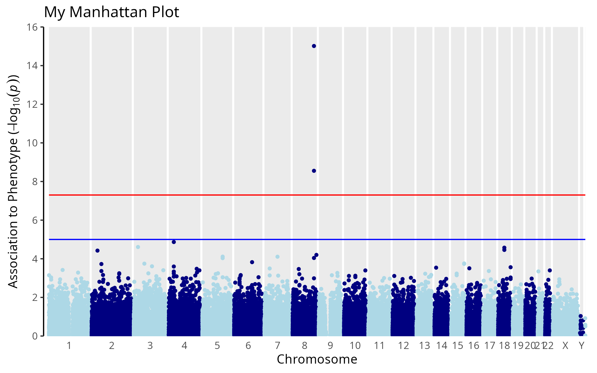
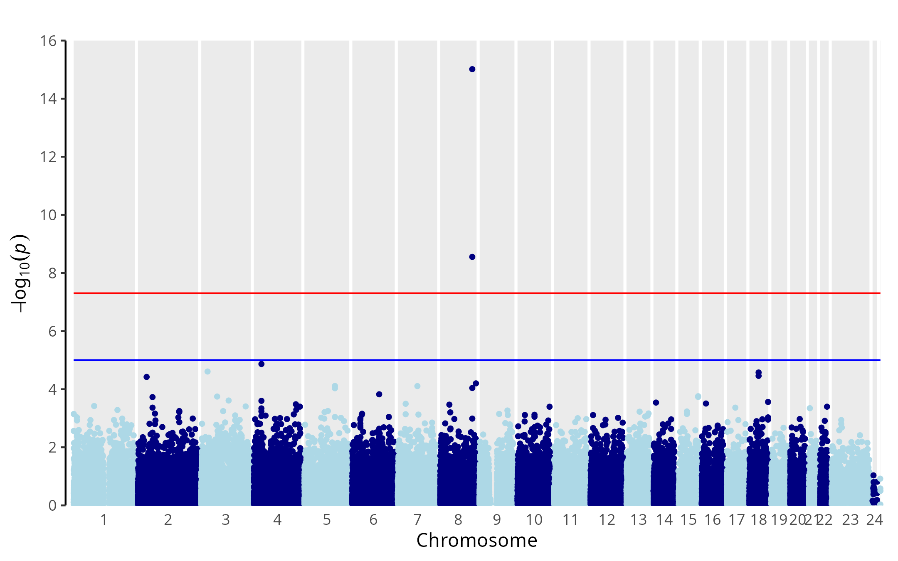
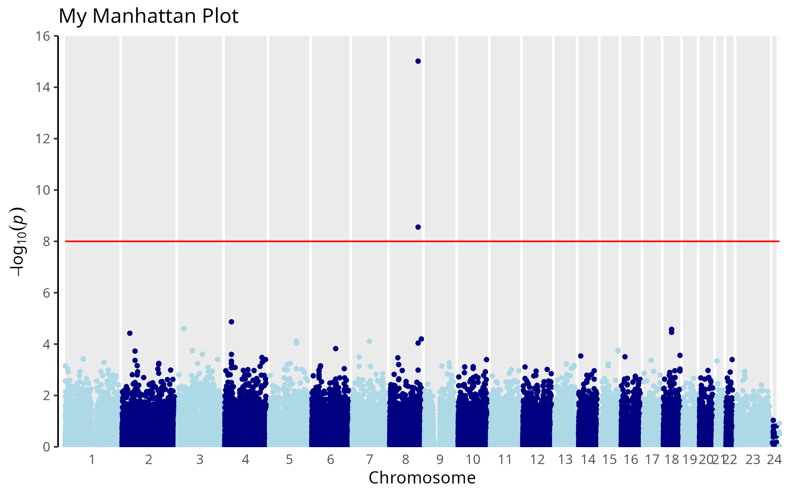
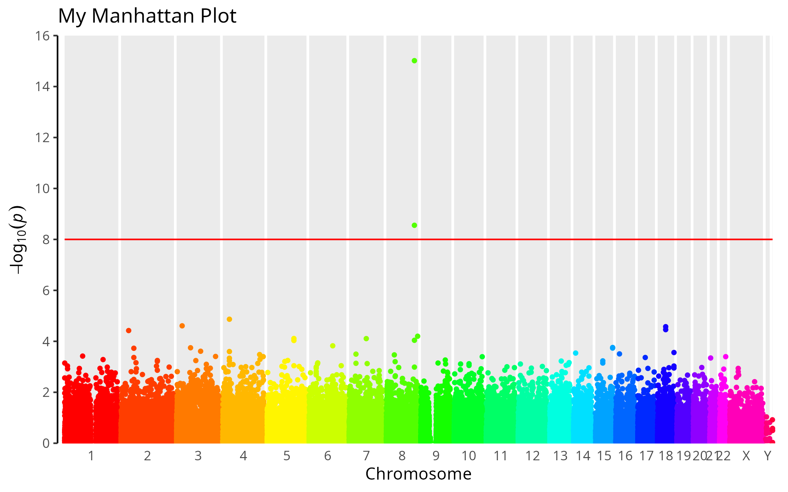
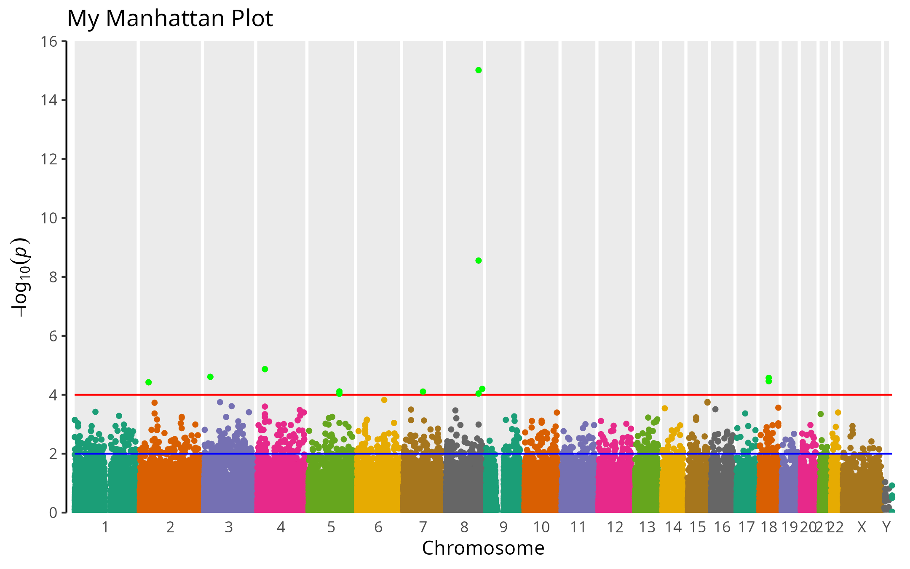
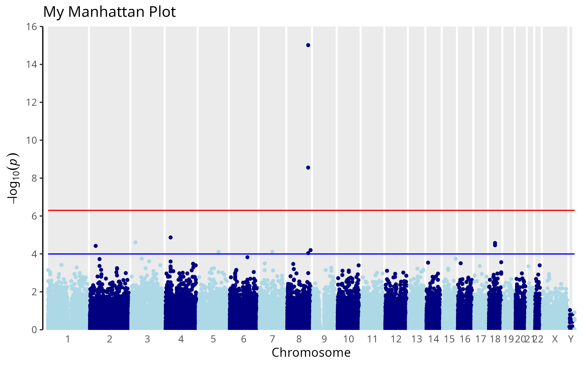
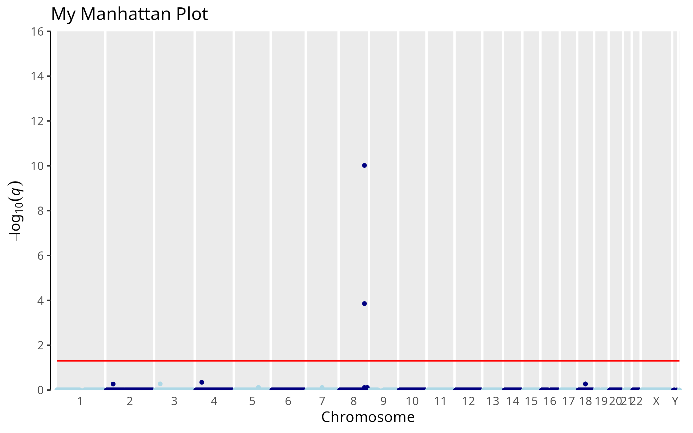
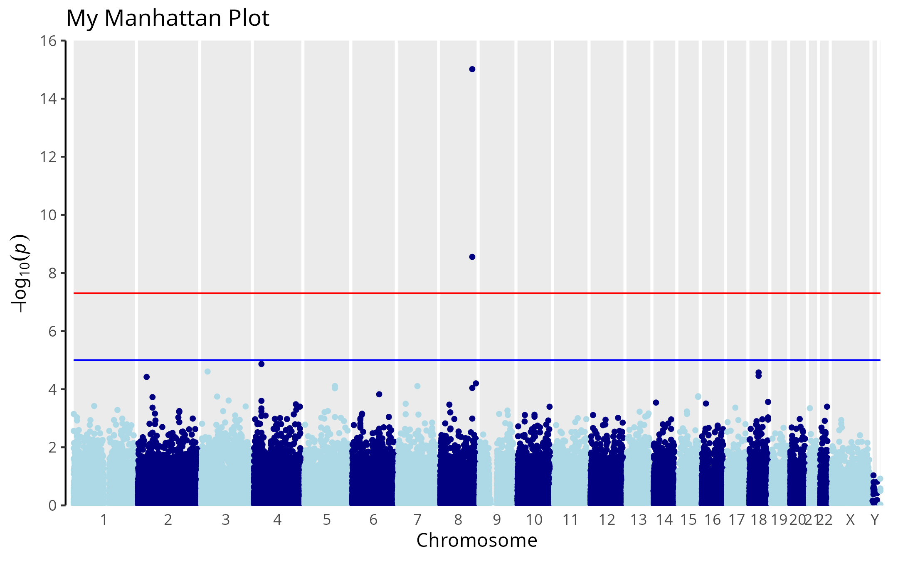
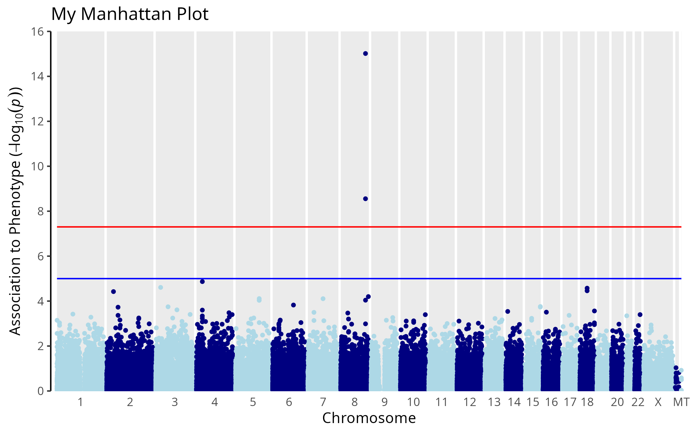

ggManhattan
================

Manhattan plots with ggplot2

-   [Installation](#installation)
-   [Usage](#usage)
    -   [Input data](#input-data)
    -   [Add title](#add-title)
    -   [Indicative lines](#indicative-lines)
    -   [Mark specific points](#mark-specific-points)
    -   [Graph appearance](#graph-appearance)
    -   [Significance level](#significance-level)
-   [Further customization](#further-customization)

An R package to generate Manhattan plots using `ggplot2`. It also returns a list of significant SNPs, according to different thresholds, if desired.



From [Wikipedia](https://en.wikipedia.org/wiki/Manhattan_plot), the free encyclopedia

A Manhattan plot is a type of scatter plot, usually used to display data with a large number of data-points - many of non-zero amplitude, and with a distribution of higher-magnitude values, for instance in genome-wide association studies (GWAS). In GWAS Manhattan plots, genomic coordinates are displayed along the X-axis, with the negative logarithm of the association P-value for each single nucleotide polymorphism (SNP) displayed on the Y-axis, meaning that each dot on the Manhattan plot signifies a SNP. Because the strongest associations have the smallest P-values (e.g., 10−15), their negative logarithms will be the greatest (e.g., 15).

The `ggManhattan` function has been used to show differential methylation as shown in a recent paper published in [Clinical Epigenetics](https://clinicalepigeneticsjournal.biomedcentral.com/articles/10.1186/s13148-020-00843-3)

Installation
============

Install from GitHub using devtools:

``` r
# install.packages("devtools")
devtools::install_github("alfonsosaera/ggManhattan")
```

Usage
=====

``` r
library(ggManhattan)
```

Input data
----------

The package includes example GWAS data. Load it and take a look at the required structure:

``` r
data(gwas_example)
head(gwas_example)
```

    ##                   SNP CHR      BP         P
    ## rs12124819 rs12124819   1  766409 0.7668670
    ## rs28705211 rs28705211   1  890368 0.8026096
    ## rs9777703   rs9777703   1  918699 0.3812962
    ## rs3121567   rs3121567   1  933331 0.6391422
    ## rs9442372   rs9442372   1 1008567 0.6082297
    ## rs3737728   rs3737728   1 1011278 0.9558932

Using function with default settings:

``` r
ggManhattan(gwas_example)
```



Add title
---------

The `graph.title` argument is used to specify a title:

``` r
ggManhattan(gwas_example, graph.title = "My Manhattan Plot")
```


Use the `font.size` argument (default is 12) to modify the size of all text elements in the graph.

``` r
ggManhattan(gwas_example, graph.title = "My Manhattan Plot", font.size = 15)
```


Indicative lines
----------------

Where to draw a "genome-wide sigificant" (red) or "suggestive" (blue) line.
`genomewideline` default is 5e-08.
`suggestiveline` default is 1e-5.

Set to FALSE to disable.

``` r
ggManhattan(gwas_example, graph.title = "My Manhattan Plot",
            suggestiveline = FALSE, genomewideline = 1e-8)
```



Both can be specified.

``` r
ggManhattan(gwas_example, graph.title = "My Manhattan Plot",
            suggestiveline = 2e-4, genomewideline = 1e-6)
```


Line colors can also be customized if desired.
`genomewidecolor` default is "red".
`suggestivecolor` default is "blue".

``` r
ggManhattan(gwas_example, graph.title = "My Manhattan Plot",
            suggestiveline = 2e-4, suggestivecolor = "orange",
            genomewideline = 1e-06, genomewidecolor = "pink")
```


Mark specific points
--------------------

Use the `highlight` argument (default is `NULL`). The `highlight.col` argument sets the color (Default is "green").

If set to a numeric value, all SNPs with a p-value lower than the specified value are marked.

``` r
ggManhattan(gwas_example, graph.title = "My Manhattan Plot", suggestiveline = FALSE,
            genomewideline = 1e-8, highlight = 1e-8)
```


You can also mark specific SNP providing the names

``` r
my.SNPs <- as.character(gwas_example$SNP[gwas_example$P < 1e-4])

ggManhattan(gwas_example, graph.title = "My Manhattan Plot", suggestiveline = 1e-6,
            genomewideline = 1e-8, highlight = my.SNPs)
```


Graph appearance
----------------

Specify chromosome names with `chrom.lab` argument:

``` r
ggManhattan(gwas_example, graph.title = "My Manhattan Plot", suggestiveline = FALSE,
            genomewideline = 1e-8, highlight = 1e-8,
            chrom.lab = c(as.character(1:22),"X","Y","MT"))
```


Specify chromosome colors with `col` argument, default is `c("lightblue", "navy")`. See <http://www.stat.columbia.edu/~tzheng/files/Rcolor.pdf> for a list of colors. See <https://www.r-bloggers.com/palettes-in-r/> for palette use in R.

<br> Example using `rainbow` default R palette. If the colors are too bright, try `col = rainbow(25, s= 0.75)`.

``` r
ggManhattan(gwas_example, graph.title = "My Manhattan Plot",
            suggestiveline = FALSE, genomewideline = 1e-8,
            col = rainbow(25),
            chrom.lab = c(as.character(1:22),"X","Y","MT"))
```



Another example using the `dark` palette of the `RColorBrewer` package. Note that the `brewer.pal` function must be used to generate the color palette.

``` r
library(RColorBrewer)

ggManhattan(gwas_example, graph.title = "My Manhattan Plot",
            col = brewer.pal(8, "Dark2"),
            highlight = 1e-4,
            suggestiveline = 1e-2,
            genomewideline = 1e-4,
            chrom.lab = c(as.character(1:22),"X","Y","MT"))
```



Significance level
------------------

Specify significance levels with `significance` argument. This argument overrides `genomewideline` and `suggestiveline`. When argument `report` is set to `TRUE` the info of the significant SNPs is printed.

`significance` argument can be a specific number

``` r
ggManhattan(gwas_example, graph.title = "My Manhattan Plot", suggestiveline = 2e-4,
            genomewideline = 1e-6,
            chrom.lab = c(as.character(1:22),"X","Y","MT"), significance = 3e-5,
            report = TRUE)
```

    ##                   SNP CHR        BP            P
    ## rs6550962   rs6550962   3  25356968 2.462824e-05
    ## rs10027212 rs10027212   4  30585306 1.357062e-05
    ## rs4733560   rs4733560   8 128848183 2.789866e-09
    ## rs10112382 rs10112382   8 128853579 9.641204e-16
    ## rs17769347 rs17769347  18  36989057 2.663669e-05


If `significance` is set to "Bonferroni", `genomewideline` is set to the corrected significance level and `suggestiveline` is modified accordingly.

``` r
ggManhattan(gwas_example, graph.title = "My Manhattan Plot", suggestiveline = 2e-4,
            genomewideline = 1e-6,
            chrom.lab = c(as.character(1:22),"X","Y","MT"), significance = "Bonferroni",
            report = TRUE)
```

    ## Bonferroni correction significance level: 5.039103e-07
    ##                   SNP CHR        BP            P
    ## rs4733560   rs4733560   8 128848183 2.789866e-09
    ## rs10112382 rs10112382   8 128853579 9.641204e-16



If `significance` is set to "FDR", `genomewideline` is set to `0.05` and `suggestiveline` to `FALSE`.

``` r
ggManhattan(gwas_example, graph.title = "My Manhattan Plot", suggestiveline = 2e-4,
            genomewideline = 1e-6,
            chrom.lab = c(as.character(1:22),"X","Y","MT"), significance = "FDR",
            report = TRUE)
```

    ##                   SNP CHR        BP            P          fdr
    ## rs4733560   rs4733560   8 128848183 2.789866e-09 1.384108e-04
    ## rs10112382 rs10112382   8 128853579 9.641204e-16 9.566388e-11



Further customization
=====================

Since the function returns a `ggplot` object you can add your own modifications.

First, store the function output in an object

``` r
mM <- ggManhattan(gwas_example, graph.title = "My Manhattan Plot",
             chrom.lab = c(as.character(1:22),"X","Y","MT"))
mM
```



Then, add your modifications. In this case, change the title of Y axis

``` r
mM + ylab(expression("Association to Phenotype (" * -log[10](italic(p)) *")"))
```


Chromosome names
=====================

As can be seen in the examples, the function tries to hide the overlapping chromosome names. If you do not like the results, you can turn it off setting `auto.hide.labels` to `FALSE` 

``` r
ggManhattan(gwas_example, graph.title = "My Manhattan Plot",
            auto.hide.labels = FALSE) + 
  ylab(expression("Association to Phenotype (" * -log[10](italic(p)) *")"))
```


and pass the chromosome names with empty labels ("") as desired.

``` r
ggManhattan(gwas_example, graph.title = "My Manhattan Plot",
            auto.hide.labels = FALSE, chrom.lab = c(as.character(1:18),"", 20,"", 22,"X","","MT")) + 
  ylab(expression("Association to Phenotype (" * -log[10](italic(p)) *")"))
```




